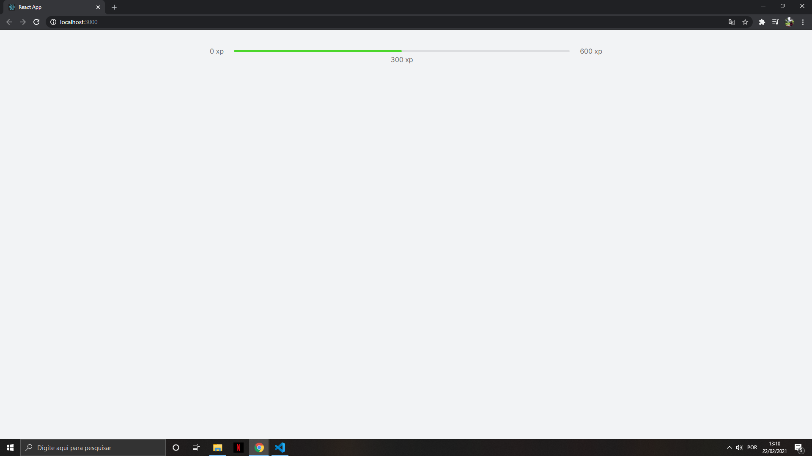
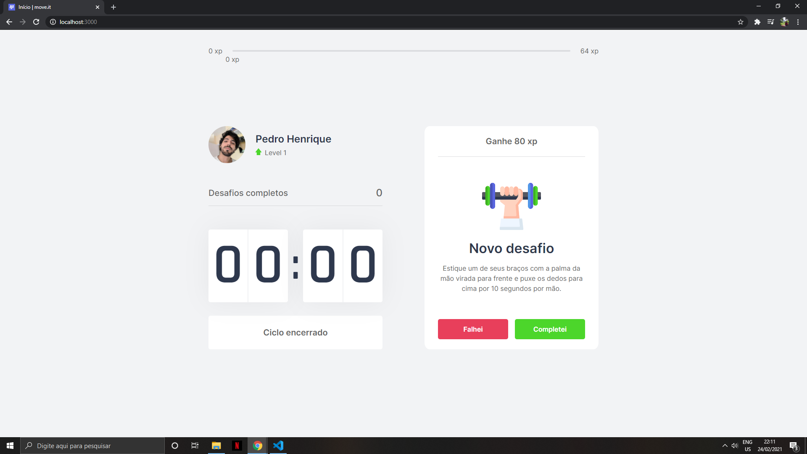
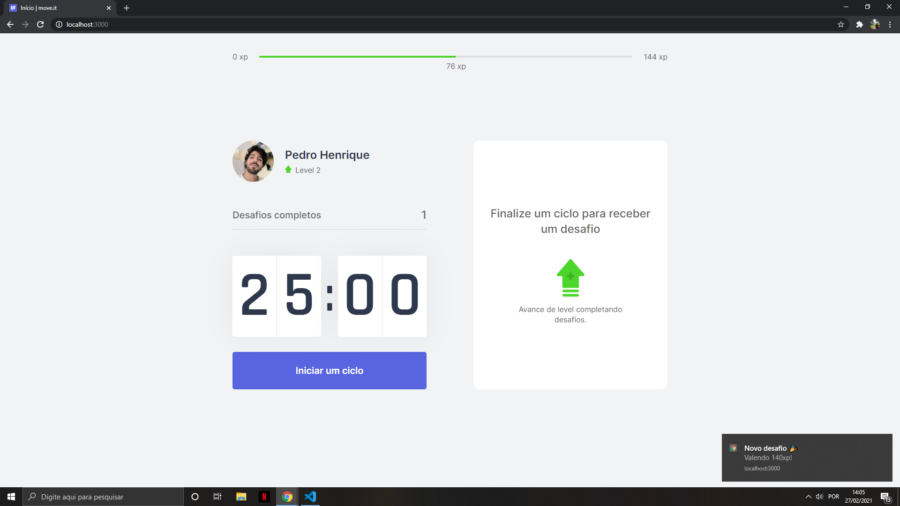
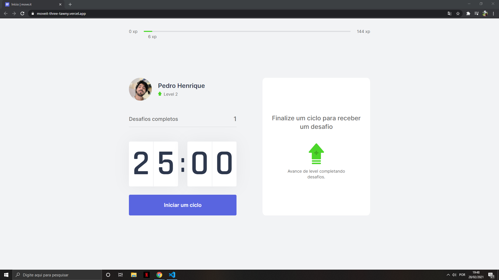

# NLW-#4Edition-TrilhaReact  

## Repositório dedicado a semana de estudos NLW#4 Edição - trilha de React 

Instrutor: Diego Fernandes - (https://github.com/diego3g) 🚀 

 Aula 1

-------------------------------------------------------------##--------------------------------------------------------------

Aula 2

-------------------------------------------------------------##--------------------------------------------------------------

Aula 3

-------------------------------------------------------------##--------------------------------------------------------------

Aula 4

-------------------------------------------------------------##--------------------------------------------------------------

Aula 5 -> https://moveit-three-tawny.vercel.app/

